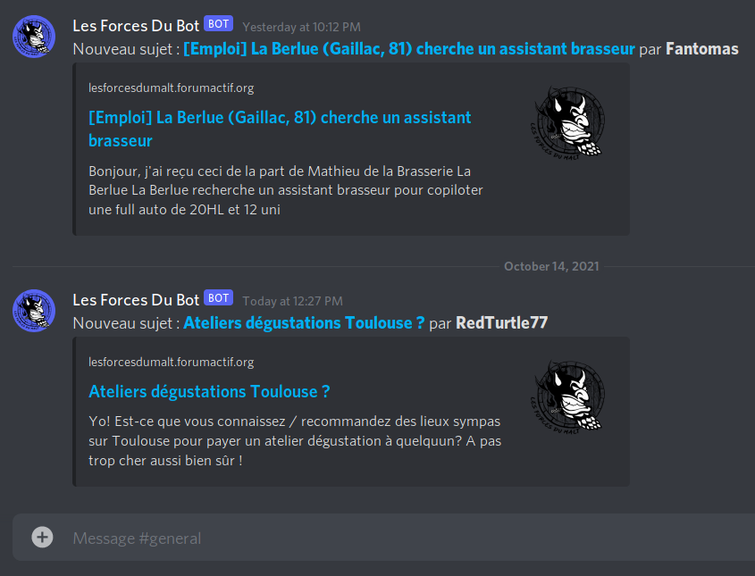

#  Les Forces Du Bot
**Script permettant de notifier certains messages du forum sur discord.**

### Règles de notification
- Tous les nouveaux messages de la section *"Annonces du groupe de gestion"* sont notifiés dans le canal *"annonces"* du discord.
- Toutes les nouvelles discussions ouvertes dans les autres sections du forum sont notifiés dans le canal *"général"* du discord.

### Configuration
Le fichier `config.py` contient des variables permettant des customisations, comme le nom du bot et le format de ses messages.

Mais il faut surtout configurer les autorisations d'accès à discord et au forum :
- créer les *webhooks discord*, pour les canaux *"annonces"* et *"général"*, et renseigner les URLs dans la config
- créer un utilisateur de forum, optionnellement dans le groupe *membres*, et renseigner user/pass dans la config

### Lancement
Pour l'instant on utilise la *crontab* pour lancer le script toutes les minutes :

`* * * * *   cd $HOME/LesForcesDuBot && python main.py`

### Démo

